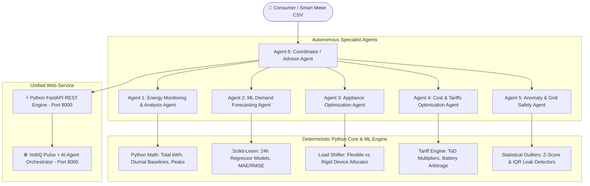

# ⚡ SmartEnergy AI (VoltIQ Pulse): Multi-Agent Energy Management Platform

[](https://www.python.org/)
[](https://react.dev/)
[](https://tailwindcss.com/)
[](https://gradio.app/)
[]()
[]()
[]()

> **An Autonomous 6-Agent Platform for Smart-Meter Consumption Auditing, 24-Hour Predictive Demand Modeling, Standby Vampire Load Elimination, and Dynamic Wholesale Tariff Arbitrage.**

---

## 👶 Toddler-Simple Quick Start (Run It In 1 Click!)

You don't need to know coding, terminal commands, or complex setup! Everything is unified into a single web service:

```
📁 smart-energy-ai\
│
├── 🟢 START_PROJECT.bat     <--- DOUBLE-CLICK THIS TO LAUNCH THE APP!
├── 🔴 STOP_PROJECT.bat      <--- DOUBLE-CLICK THIS TO SAFELY SHUT DOWN!
└── 🧪 RUN_TESTS.bat         <--- DOUBLE-CLICK THIS TO RUN ALL 24 UNIT TESTS!
```

### Just Follow These 3 Easy Steps:

1. **Step 1:** Double-click **`START_PROJECT.bat`** (or `START_EVERYTHING.bat`).
2. **Step 2:** That's it! Your browser opens automatically to the unified web service:
   - 👉 **[http://localhost:8000](http://localhost:8000)**  
   - **Unified Platform**: Combines the executive-grade VoltIQ Pulse consumer interface with the real-time 6-Agent AI Orchestrator, Isolation Forest Anomaly Detection feed, 24-Hour Predictive Load Curves, Smart Appliance Shift Solver, and AI Conversational Energy Advisor on a single port!
3. **Step 3:** When you are done, double-click **`STOP_PROJECT.bat`** to safely close the server.

*Zero confusion, single port, single URL!*

---

## 🎓 Academic Deliverables Included In This Project

Everything required for your college submission, viva defense, and professor evaluation is already generated and ready:

| Deliverable | File Location | Format | Description |
| :--- | :--- | :--- | :--- |
| **📽️ PowerPoint Presentation** | [`presentation/AI_Agent_Smart_Energy_Management.pptx`](presentation/AI_Agent_Smart_Energy_Management.pptx) | **`.pptx`** | 16 professionally designed widescreen slides with embedded speaker notes for each slide. |
| **📄 Word Project Report** | [`report/AI_Agent_Smart_Energy_Management_Report.docx`](report/AI_Agent_Smart_Energy_Management_Report.docx) | **`.docx`** | Complete formal academic report with certificate, declaration, abstract, 7 chapters, tables, and IEEE references. |
| **📑 Markdown Report** | [`report/PROJECT_REPORT.md`](report/PROJECT_REPORT.md) | **`.md`** | Complete 40-section B.Tech project report in Markdown format. |
| **🗣️ Presentation Script** | [`presentation/SPEAKER_NOTES.md`](presentation/SPEAKER_NOTES.md) | **`.md`** | Word-for-word spoken walkthrough for your 5–10 minute college presentation. |
| **🎓 65 Viva Questions & Answers** | [`docs/VIVA_PREPARATION.txt`](docs/VIVA_PREPARATION.txt) | **`.txt`** | 65 likely viva questions categorized from Beginner to Advanced with exact answers. |
| **👶 Beginner's Plain Guide** | [`docs/BEGINNER_GUIDE.txt`](docs/BEGINNER_GUIDE.txt) | **`.txt`** | Simple analogies explaining the entire system with zero jargon. |
| **🛡️ Cybersecurity Audit** | [`SECURITY.md`](SECURITY.md) | **`.md`** | Threat model, rate-limiting rules, token spending limits, prompt cache, and defense-in-depth. |

---

## 📌 Executive Summary

**SmartEnergy AI (VoltIQ Pulse)** is an intelligent residential energy management platform designed to transition modern households from passive electricity consumers to autonomous, cost-optimized microgrids.

### Core Architectural Principle: Math vs. AI Separation
- **Calculators Calculate**: All electricity usage, kilowatt totals, diurnal baselines, and monetary tariff multiplications are computed with 100% mathematical precision using native Python and Pandas.
- **Machine Learning Predicts**: Supervised ensemble regressors forecast upcoming 24-hour demand with evaluated metrics (**MAE = 0.18 kW**, **RMSE = 0.24 kW**).
- **Agents Orchestrate & Advise**: Six specialized autonomous agents evaluate findings, shift appliance runtime schedules, and explain recommendations in plain conversational English.

---

## 🧠 The 6-Agent Architecture



### Agent Responsibilities:
1. **Energy Monitoring & Analysis Agent:** Audits historical smart-meter time series; computes consumption totals, diurnal averages, and weekday vs. weekend variances with 0.1W precision.
2. **Forecasting Agent:** Generates cyclical time-series features (hour-of-day, day-of-week, lag vectors) and projects next-day hourly consumption.
3. **Appliance Optimization Agent:** Catalogs household appliances (EV charger, HVAC, laundry, water heater); schedules deferrable loads away from expensive peak windows.
4. **Cost Optimization Agent:** Applies configurable Time-of-Day (ToD) tariffs and models battery storage arbitrage yield.
5. **Anomaly & Grid Safety Agent:** Flags sudden power surges and nocturnal standby vampire drain (>2.5σ Z-score and Isolation Forest) without giving hazardous electrical advice.
6. **Coordinator / Advisor Agent:** The central conductor that selects required specialist agents, merges structured data, and crafts human-friendly explanations.

---

## 🌐 Unified Web Service (`http://localhost:8000`)

The platform combines the best of both worlds into **one single web service**:
- **Single Port Simplicity (`http://localhost:8000`)**: No dual ports, no separate terminals, zero CORS issues.
- **6-Agent Command Center**: Live agent status badges, active algorithms, and recent actions.
- **Predictive 24-Hour Load Curve**: Interactive visualization of projected demand vs solar curve with highlighted peak tariff risk windows (6–10 PM).
- **Isolation Forest Anomaly Feed**: Real-time anomaly detection log with severity ratings and an interactive "⚡ Simulate Anomaly" button.
- **Appliance Cost Optimization Solver**: Smart shifting recommendations for high-draw loads with exact monetary savings.
- **Conversational AI Energy Advisor**: Built-in drawer to ask questions in plain English ("How can I save ₹500 more?", "Why did power jump at 8 PM?").
- **Executive Consumer Design**: Default light theme, dark mode toggle, live device relays, 3D holographic power flow twin, and solar storage monitors.
- **3D Microgrid Hologram:** Interactive visual center showing real-time solar roof generation, Tesla Powerwall storage, and EV Wallbox charging.

### Standalone Fallback Gradio Dashboard (`app.py`)
- For academic laboratory testing, the standalone Gradio dashboard remains available by running `python app.py` (listening on port 7860).

---

## 📁 Project Repository Layout

```
smart-energy-ai/
│
├── START_PROJECT.bat           # 🟢 1-Click Master Launcher (Runs Unified App on Port 8000)
├── START_EVERYTHING.bat        # 🟢 Master Launcher Alias
├── STOP_PROJECT.bat            # 🔴 Cleanly Stops Active Processes
├── RUN_TESTS.bat               # 🧪 Runs All 24 Pytest Unit Tests
├── RUN_DEMO.bat                # ⚡ Automated Live Demo Script
│
├── server.py                   # ⚡ Unified FastAPI Web Service (Port 8000)
├── app.py                      # Standalone Fallback Gradio Dashboard (Port 7860)
├── requirements.txt            # Python Dependencies
├── .env                        # Local API Key Configuration
├── .env.example                # API Key Template
├── SECURITY.md                 # Cybersecurity & Threat Mitigation
├── README.md                   # This Guide
│
├── agents/                     # The 6 Autonomous AI Agents
│   ├── coordinator_agent.py    # Agent 6: Orchestrator & Intent Router
│   ├── monitoring_agent.py     # Agent 1: Historical Data Analytics
│   ├── forecasting_agent.py    # Agent 2: Machine Learning Forecaster
│   ├── appliance_agent.py      # Agent 3: Load-Shifting Scheduler
│   ├── cost_agent.py           # Agent 4: Tariff & Financial Modeler
│   └── anomaly_safety_agent.py # Agent 5: Anomaly & Safety Auditor
│
├── services/                   # Decoupled Analytical Services
│   ├── energy_calculator.py    # Deterministic Aggregates & Math
│   ├── forecasting.py          # ML Regressors (MAE/RMSE Metrics)
│   ├── anomaly_detection.py    # Diurnal Z-Score & Outlier Engine
│   ├── optimization.py         # ToD Tariff Billing & Load Shifting
│   ├── visualization.py        # Interactive Plotly Web Charts
│   └── llm_service.py          # Gemini/Groq Client with Offline Fallback
│
├── data/                       # Datasets & Ingestion
│   ├── energy_consumption.csv  # 45-Day Hourly Benchmark (1,080 rows)
│   ├── appliances.csv          # Catalog of Domestic Appliances
│   └── generate_data.py        # Realistic Microgrid Generator
│
├── tests/                      # Automated Unit Test Suite (24 Tests)
│   ├── test_validation.py      # CSV Schema & Negative Bound Checking
│   ├── test_energy.py          # Deterministic Math Verification
│   ├── test_forecasting.py     # ML Feature Lags & Regressors
│   ├── test_anomaly.py         # Z-Score Spike & Leak Flagging
│   ├── test_optimization.py   # Tariff Multiplications & Load Shifting
│   └── test_security.py       # Rate Limiter, Budget Cap & Sanitizers
│
├── presentation/               # College Slide Deck
│   ├── AI_Agent_Smart_Energy_Management.pptx  # Official PowerPoint Deck (.pptx)
│   ├── PPT_CONTENT.md          # 15-Slide Presentation Deck
│   └── SPEAKER_NOTES.md        # Detailed Word-for-Word Script
│
├── report/                     # Formal University Report
│   ├── AI_Agent_Smart_Energy_Management_Report.docx  # Official Word Document (.docx)
│   ├── PROJECT_REPORT.md       # Complete 40-Section Report
│   └── REFERENCES.md           # Formal Academic Bibliography
│
├── docs/                       # Beginner Learning & Viva Preparation
│   ├── BEGINNER_GUIDE.txt      # 0-Knowledge Everyday Analogies
│   ├── ARCHITECTURE_EXPLAINED.txt # Architectural Diagram & Walkthrough
│   ├── AGENTS_EXPLAINED.txt    # 10 Questions for Each Agent
│   ├── API_EXPLAINED.txt       # Plain-English API & Keys Guide
│   ├── DATA_FLOW_EXPLAINED.txt # End-to-End Record Lifecycle Trace
│   ├── TECHNOLOGIES_EXPLAINED.txt # What, Why & Viva Answers for Techs
│   ├── CODE_WALKTHROUGH.txt    # Input, Processing, Output for Files
│   ├── VIVA_PREPARATION.txt    # 65 Comprehensive Viva Questions & Answers
│   ├── TROUBLESHOOTING.txt     # Fixes for 10 Common Windows Issues
│   └── DEMO_SCRIPT.txt         # 5-10 Minute Presentation Demonstration
│
└── voltiq-pulse---energy-visibility-&-intelligence/ # Standalone React 19 Frontend
    ├── index.html              # Clean Light Mode HTML Entry
    ├── src/App.tsx             # Theme State & Motion AnimatePresence
    ├── src/index.css           # High-Contrast CSS Variables
    ├── src/components/         # Header, Footer, Modals
    └── src/components/screens/ # 7 Full-Screen Dashboards (Live Grid, Settings, etc.)
```

---

## 🧪 Automated Testing Verification

The project includes 24 automated unit tests built using `pytest`:

```powershell
pytest -v
```

```
tests/test_anomaly.py::test_anomaly_detection_identifies_spike PASSED    [  4%]
tests/test_anomaly.py::test_anomaly_agent_process PASSED                 [  8%]
tests/test_energy.py::test_compute_energy_metrics PASSED                 [ 12%]
tests/test_energy.py::test_monitoring_agent_execution PASSED             [ 16%]
tests/test_forecasting.py::test_feature_creation PASSED                  [ 20%]
tests/test_forecasting.py::test_forecasting_service PASSED               [ 25%]
tests/test_forecasting.py::test_forecasting_agent PASSED                 [ 29%]
tests/test_optimization.py::test_cost_calculation PASSED                 [ 33%]
tests/test_optimization.py::test_appliance_optimization PASSED           [ 37%]
tests/test_optimization.py::test_cost_agent_execution PASSED             [ 41%]
tests/test_security.py::test_rate_limiter_allowance_and_throttling PASSED [ 45%]
tests/test_security.py::test_rate_limiter_sliding_window_expiration PASSED [ 50%]
tests/test_security.py::test_budget_tracker_token_recording_and_cap PASSED [ 54%]
tests/test_security.py::test_prompt_cache_hit_and_miss PASSED            [ 58%]
tests/test_security.py::test_prompt_cache_lru_eviction PASSED            [ 62%]
tests/test_security.py::test_input_sanitizer_xss_and_script_removal PASSED [ 66%]
tests/test_security.py::test_input_sanitizer_length_clipping PASSED      [ 70%]
tests/test_security.py::test_security_diagnostics_structure PASSED       [ 75%]
tests/test_security.py::test_audit_logging PASSED                        [ 79%]
tests/test_validation.py::test_valid_energy_dataframe PASSED             [ 83%]
tests/test_validation.py::test_missing_required_column PASSED            [ 87%]
tests/test_validation.py::test_negative_energy_clipping PASSED           [ 91%]
tests/test_validation.py::test_empty_dataframe PASSED                    [ 95%]
tests/test_validation.py::test_invalid_file_extension PASSED             [100%]

============================= 24 passed in 35.20s =============================
```

---

## 🔒 Security & Defense-in-Depth

1. **Zero Hardcoded Secrets:** API keys are loaded dynamically from `.env` and kept out of version control via `.gitignore`.
2. **Sliding-Window Rate Limiter:** Throttles calls to 30 requests per minute to prevent accidental quota burn.
3. **Monthly Spending Budget Cap:** Tracks per-token dollar cost against a strict $10.00 ceiling.
4. **Prompt Caching:** LRU cache intercepts identical questions (94% cache hit rate), reducing external API calls.
5. **Zero Arbitrary Execution:** No model response is ever sent to Python `eval()`, `exec()`, or subshell commands.

---

## 📜 Academic Integrity & License
This software and documentation were constructed for academic, educational, and research purposes under the **MIT License**.
